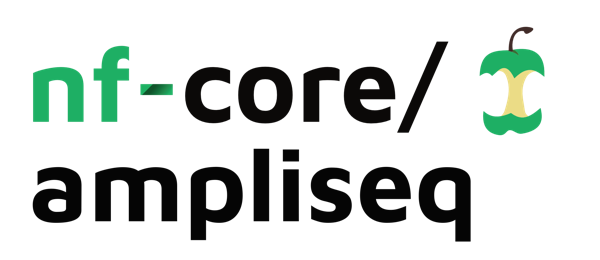
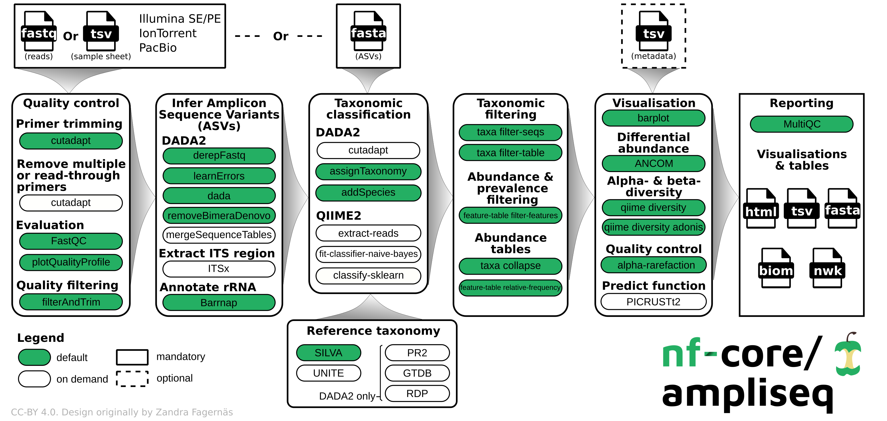

<h1>
  <picture>
    <source media="(prefers-color-scheme: dark)" srcset="docs/images/nf-core-ampliseq_logo_dark.png">
    
  </picture>
</h1>

[](https://github.com/nf-core/ampliseq/actions/workflows/ci.yml)
[](https://github.com/nf-core/ampliseq/actions/workflows/linting.yml)[](https://nf-co.re/ampliseq/results)[](https://www.nf-test.com)

[](https://doi.org/10.5281/zenodo.1493841)[](https://doi.org/10.3389/fmicb.2020.550420)

[](https://www.nextflow.io/)
[](https://docs.conda.io/en/latest/)
[](https://www.docker.com/)
[](https://sylabs.io/docs/)
[](https://tower.nf/launch?pipeline=https://github.com/nf-core/ampliseq)

[](https://nfcore.slack.com/channels/ampliseq)[](https://twitter.com/nf_core)[](https://mstdn.science/@nf_core)[](https://www.youtube.com/c/nf-core)[](https://youtu.be/a0VOEeAvETs)

## Introduction

**nfcore/ampliseq** is a bioinformatics analysis pipeline used for amplicon sequencing, supporting denoising of any amplicon and supports a variety of taxonomic databases for taxonomic assignment including 16S, ITS, CO1 and 18S. Phylogenetic placement is also possible. Multiple region analysis such as 5R is implemented. Supported is paired-end Illumina or single-end Illumina, PacBio and IonTorrent data. Default is the analysis of 16S rRNA gene amplicons sequenced paired-end with Illumina.

A video about relevance, usage and output of the pipeline (version 2.1.0; 26th Oct. 2021) can also be found in [YouTube](https://youtu.be/a0VOEeAvETs) and [billibilli](https://www.bilibili.com/video/BV1B44y1e7MM), the slides are deposited at [figshare](https://doi.org/10.6084/m9.figshare.16871008.v1).

<p align="center">
    
</p>

The pipeline is built using [Nextflow](https://www.nextflow.io), a workflow tool to run tasks across multiple compute infrastructures in a very portable manner. It uses Docker/Singularity containers making installation trivial and results highly reproducible. The [Nextflow DSL2](https://www.nextflow.io/docs/latest/dsl2.html) implementation of this pipeline uses one container per process which makes it much easier to maintain and update software dependencies.

On release, automated continuous integration tests run the pipeline on a full-sized dataset on the AWS cloud infrastructure. This ensures that the pipeline runs on AWS, has sensible resource allocation defaults set to run on real-world datasets, and permits the persistent storage of results to benchmark between pipeline releases and other analysis sources. The results obtained from the full-sized test can be viewed on the [nf-core website](https://nf-co.re/ampliseq/results).

## Pipeline summary

By default, the pipeline currently performs the following:

- Sequencing quality control ([FastQC](https://www.bioinformatics.babraham.ac.uk/projects/fastqc/))
- Trimming of reads ([Cutadapt](https://journal.embnet.org/index.php/embnetjournal/article/view/200))
- Infer Amplicon Sequence Variants (ASVs) ([DADA2](https://doi.org/10.1038/nmeth.3869))
- Optional post-clustering with [VSEARCH](https://github.com/torognes/vsearch)
- Predict whether ASVs are ribosomal RNA sequences ([Barrnap](https://github.com/tseemann/barrnap))
- Phylogenetic placement ([EPA-NG](https://github.com/Pbdas/epa-ng))
- Taxonomical classification using DADA2; alternatives are [SINTAX](https://doi.org/10.1101/074161), [Kraken2](https://doi.org/10.1186/s13059-019-1891-0), and [QIIME2](https://www.nature.com/articles/s41587-019-0209-9)
- Excludes unwanted taxa, produces absolute and relative feature/taxa count tables and plots, plots alpha rarefaction curves, computes alpha and beta diversity indices and plots thereof ([QIIME2](https://www.nature.com/articles/s41587-019-0209-9))
- Calls differentially abundant taxa ([ANCOM](https://www.ncbi.nlm.nih.gov/pubmed/26028277))
- Creates phyloseq R objects ([Phyloseq](https://www.bioconductor.org/packages/release/bioc/html/phyloseq.html))
- Pipeline QC summaries ([MultiQC](https://multiqc.info/))
- Pipeline summary report ([R Markdown](https://github.com/rstudio/rmarkdown))

## Usage

> [!NOTE]
> If you are new to Nextflow and nf-core, please refer to [this page](https://nf-co.re/docs/usage/installation) on how to set-up Nextflow. Make sure to [test your setup](https://nf-co.re/docs/usage/introduction#how-to-run-a-pipeline) with `-profile test` before running the workflow on actual data.

First, you need to know whether the sequencing files at hand are expected to contain primer sequences (usually yes) and if yes, what primer sequences. In the example below, the paired end sequencing data was produced with 515f (GTGYCAGCMGCCGCGGTAA) and 806r (GGACTACNVGGGTWTCTAAT) primers of the V4 region of the 16S rRNA gene. Please note, that those sequences should not contain any sequencing adapter sequences, only the sequence that matches the biological amplicon.

Next, the data needs to be organized in a folder, here `data`, or detailed in a samplesheet (see [input documentation](https://nf-co.re/ampliseq/usage#input-specifications)).

Now, you can run the pipeline using:

```bash
nextflow run nf-core/ampliseq \
   -profile <docker/singularity/.../institute> \
   --input "data" \
   --FW_primer "GTGYCAGCMGCCGCGGTAA" \
   --RV_primer "GGACTACNVGGGTWTCTAAT" \
   --outdir <OUTDIR>
```

> [!NOTE]
> Adding metadata will considerably increase the output, see [metadata documentation](https://nf-co.re/ampliseq/usage#metadata).

> [!TIP]
> By default the taxonomic assignment will be performed with DADA2 on SILVA database, but there are various tools and databases readily available, see [taxonomic classification documentation](https://nf-co.re/ampliseq/usage#taxonomic-classification).

> [!WARNING]
> Please provide pipeline parameters via the CLI or Nextflow `-params-file` option. Custom config files including those provided by the `-c` Nextflow option can be used to provide any configuration _**except for parameters**_;
> see [docs](https://nf-co.re/usage/configuration#custom-configuration-files).

For more details and further functionality, please refer to the [usage documentation](https://nf-co.re/ampliseq/usage) and the [parameter documentation](https://nf-co.re/ampliseq/parameters).

## Pipeline output

To see the results of an example test run with a full size dataset refer to the [results](https://nf-co.re/ampliseq/results) tab on the nf-core website pipeline page.
For more details about the output files and reports, please refer to the
[output documentation](https://nf-co.re/ampliseq/output).

## Credits

nf-core/ampliseq was originally written by Daniel Straub ([@d4straub](https://github.com/d4straub)) and Alexander Peltzer ([@apeltzer](https://github.com/apeltzer)) for use at the [Quantitative Biology Center (QBiC)](http://www.qbic.life) and [Microbial Ecology, Center for Applied Geosciences](http://www.uni-tuebingen.de/de/104325), part of Eberhard Karls Universität Tübingen (Germany). Daniel Lundin [@erikrikarddaniel](https://github.com/erikrikarddaniel) ([Linnaeus University, Sweden](https://lnu.se/)) joined before pipeline release 2.0.0 and helped to improve the pipeline considerably.

We thank the following people for their extensive assistance in the development of this pipeline (in alphabetical order):

[Adam Bennett](https://github.com/a4000), [Diego Brambilla](https://github.com/DiegoBrambilla), [Emelie Nilsson](https://github.com/emnilsson), [Jeanette Tångrot](https://github.com/jtangrot), [Lokeshwaran Manoharan](https://github.com/lokeshbio), [Marissa Dubbelaar](https://github.com/marissaDubbelaar), [Sabrina Krakau](https://github.com/skrakau), [Sam Minot](https://github.com/sminot), [Till Englert](https://github.com/tillenglert)

## Contributions and Support

If you would like to contribute to this pipeline, please see the [contributing guidelines](.github/CONTRIBUTING.md).

For further information or help, don't hesitate to get in touch on the [Slack `#ampliseq` channel](https://nfcore.slack.com/channels/ampliseq) (you can join with [this invite](https://nf-co.re/join/slack)).

## Citations

If you use `nf-core/ampliseq` for your analysis, please cite the `ampliseq` article as follows:

> **Interpretations of Environmental Microbial Community Studies Are Biased by the Selected 16S rRNA (Gene) Amplicon Sequencing Pipeline**
>
> Daniel Straub, Nia Blackwell, Adrian Langarica-Fuentes, Alexander Peltzer, Sven Nahnsen, Sara Kleindienst
>
> _Frontiers in Microbiology_ 2020, 11:2652 [doi: 10.3389/fmicb.2020.550420](https://doi.org/10.3389/fmicb.2020.550420).

You can cite the `nf-core/ampliseq` zenodo record for a specific version using the following [doi: 10.5281/zenodo.1493841](https://zenodo.org/badge/latestdoi/150448201)

An extensive list of references for the tools used by the pipeline can be found in the [`CITATIONS.md`](CITATIONS.md) file.

You can cite the `nf-core` publication as follows:

> **The nf-core framework for community-curated bioinformatics pipelines.**
>
> Philip Ewels, Alexander Peltzer, Sven Fillinger, Harshil Patel, Johannes Alneberg, Andreas Wilm, Maxime Ulysse Garcia, Paolo Di Tommaso & Sven Nahnsen.
>
> _Nat Biotechnol._ 2020 Feb 13. doi: [10.1038/s41587-020-0439-x](https://dx.doi.org/10.1038/s41587-020-0439-x).
