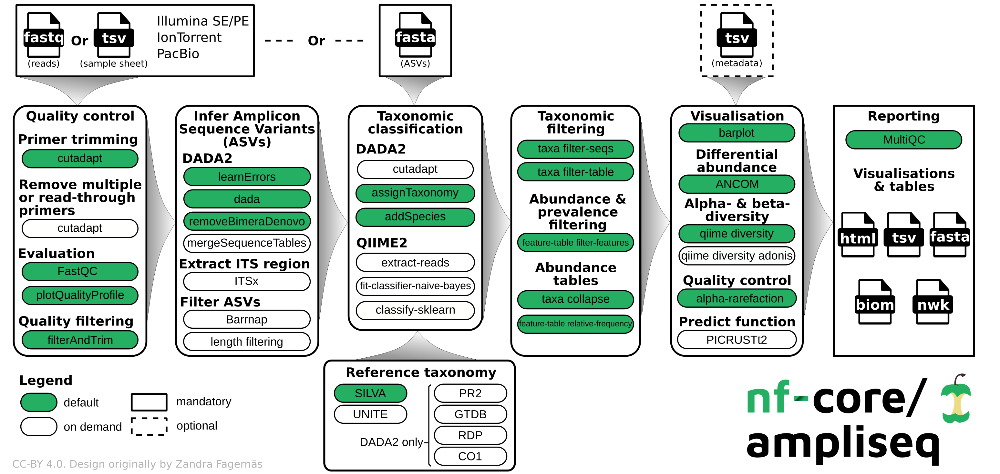

#  

[](https://doi.org/10.5281/zenodo.1493841)
[](https://doi.org/10.3389/fmicb.2020.550420)

[](https://github.com/nf-core/ampliseq/actions?query=workflow%3A%22nf-core+CI%22)
[](https://github.com/nf-core/ampliseq/actions?query=workflow%3A%22nf-core+linting%22)
[](https://nf-co.re/ampliseq/results)

[](https://www.nextflow.io/)
[](https://docs.conda.io/en/latest/)
[](https://www.docker.com/)
[](https://sylabs.io/docs/)

[](https://nfcore.slack.com/channels/ampliseq)
[](https://twitter.com/nf_core)
[](https://www.youtube.com/c/nf-core)

## Introduction

**nfcore/ampliseq** is a bioinformatics analysis pipeline used for amplicon sequencing, supporting denoising of any amplicon and, currently, taxonomic assignment of 16S, ITS and 18S amplicons. Supported is paired-end Illumina or single-end Illumina, PacBio and IonTorrent data. Default is the analysis of 16S rRNA gene amplicons sequenced paired-end with Illumina.

<p align="center">
    
</p>

The pipeline is built using [Nextflow](https://www.nextflow.io), a workflow tool to run tasks across multiple compute infrastructures in a very portable manner. It uses Docker/Singularity containers making installation trivial and results highly reproducible. The [Nextflow DSL2](https://www.nextflow.io/docs/latest/dsl2.html) implementation of this pipeline uses one container per process which makes it much easier to maintain and update software dependencies. Where possible, these processes have been submitted to and installed from [nf-core/modules](https://github.com/nf-core/modules) in order to make them available to all nf-core pipelines, and to everyone within the Nextflow community!

On release, automated continuous integration tests run the pipeline on a full-sized dataset on the AWS cloud infrastructure. This ensures that the pipeline runs on AWS, has sensible resource allocation defaults set to run on real-world datasets, and permits the persistent storage of results to benchmark between pipeline releases and other analysis sources. The results obtained from the full-sized test can be viewed on the [nf-core website](https://nf-co.re/ampliseq/results).

## Pipeline summary

By default, the pipeline currently performs the following:

* Sequencing quality control ([FastQC](https://www.bioinformatics.babraham.ac.uk/projects/fastqc/))
* Trimming of reads ([Cutadapt](https://journal.embnet.org/index.php/embnetjournal/article/view/200))
* Infer Amplicon Sequence Variants (ASVs) ([DADA2](https://doi.org/10.1038/nmeth.3869))
* Taxonomical classification using DADA2 or [QIIME2](https://www.nature.com/articles/s41587-019-0209-9)
* Excludes unwanted taxa, produces absolute and relative feature/taxa count tables and plots, plots alpha rarefaction curves, computes alpha and beta diversity indices and plots thereof ([QIIME2](https://www.nature.com/articles/s41587-019-0209-9))
* Calls differentially abundant taxa ([ANCOM](https://www.ncbi.nlm.nih.gov/pubmed/26028277))
* Overall pipeline run summaries ([MultiQC](https://multiqc.info/))

## Quick Start

1. Install [`Nextflow`](https://www.nextflow.io/docs/latest/getstarted.html#installation) (`>=21.10.3`)

2. Install any of [`Docker`](https://docs.docker.com/engine/installation/), [`Singularity`](https://www.sylabs.io/guides/3.0/user-guide/), [`Podman`](https://podman.io/), [`Shifter`](https://nersc.gitlab.io/development/shifter/how-to-use/) or [`Charliecloud`](https://hpc.github.io/charliecloud/) for full pipeline reproducibility _(please only use [`Conda`](https://conda.io/miniconda.html) as a last resort; see [docs](https://nf-co.re/usage/configuration#basic-configuration-profiles))_

3. Download the pipeline and test it on a minimal dataset with a single command:

    ```console
    nextflow run nf-core/ampliseq -profile test,YOURPROFILE
    ```

    Note that some form of configuration will be needed so that Nextflow knows how to fetch the required software. This is usually done in the form of a config profile (`YOURPROFILE` in the example command above). You can chain multiple config profiles in a comma-separated string.

    > * The pipeline comes with config profiles called `docker`, `singularity`, `podman`, `shifter`, `charliecloud` and `conda` which instruct the pipeline to use the named tool for software management. For example, `-profile test,docker`.
    > * Please check [nf-core/configs](https://github.com/nf-core/configs#documentation) to see if a custom config file to run nf-core pipelines already exists for your Institute. If so, you can simply use `-profile <institute>` in your command. This will enable either `docker` or `singularity` and set the appropriate execution settings for your local compute environment.
    > * If you are using `singularity` and are persistently observing issues downloading Singularity images directly due to timeout or network issues, then you can use the `--singularity_pull_docker_container` parameter to pull and convert the Docker image instead. Alternatively, you can use the [`nf-core download`](https://nf-co.re/tools/#downloading-pipelines-for-offline-use) command to download images first, before running the pipeline. Setting the [`NXF_SINGULARITY_CACHEDIR` or `singularity.cacheDir`](https://www.nextflow.io/docs/latest/singularity.html?#singularity-docker-hub) Nextflow options enables you to store and re-use the images from a central location for future pipeline runs.
    > * If you are using `conda`, it is highly recommended to use the [`NXF_CONDA_CACHEDIR` or `conda.cacheDir`](https://www.nextflow.io/docs/latest/conda.html) settings to store the environments in a central location for future pipeline runs.

4. Start running your own analysis!

    ```console
    #16S rRNA gene amplicon analysis of Illumina paired-end data
    nextflow run nf-core/ampliseq -profile <docker/singularity/podman/shifter/charliecloud/conda/institute> --input "data" --FW_primer "GTGYCAGCMGCCGCGGTAA" --RV_primer "GGACTACNVGGGTWTCTAAT" --metadata "data/Metadata.tsv"
    ```

See [usage docs](https://nf-co.re/ampliseq/usage) and [parameter docs](https://nf-co.re/ampliseq/parameters) for all of the available options when running the pipeline.

## Documentation

The nf-core/ampliseq pipeline comes with documentation about the pipeline [usage](https://nf-co.re/ampliseq/usage), [parameters](https://nf-co.re/ampliseq/parameters) and [output](https://nf-co.re/ampliseq/output).

## Credits

nf-core/ampliseq was originally written by Daniel Straub ([@d4straub](https://github.com/d4straub)) and Alexander Peltzer ([@apeltzer](https://github.com/apeltzer)) for use at the [Quantitative Biology Center (QBiC)](http://www.qbic.life) and [Microbial Ecology, Center for Applied Geosciences](http://www.uni-tuebingen.de/de/104325), part of Eberhard Karls Universität Tübingen (Germany).

We thank the following people for their extensive assistance in the development of this pipeline (in alphabetical order):

* [Daniel Lundin](https://github.com/erikrikarddaniel)
* [Diego Brambilla](https://github.com/DiegoBrambilla)
* [Emelie Nilsson](https://github.com/emnilsson)
* [Jeanette Tångrot](https://github.com/jtangrot)
* [Sabrina Krakau](https://github.com/skrakau)

## Contributions and Support

If you would like to contribute to this pipeline, please see the [contributing guidelines](.github/CONTRIBUTING.md).

For further information or help, don't hesitate to get in touch on the [Slack `#ampliseq` channel](https://nfcore.slack.com/channels/ampliseq) (you can join with [this invite](https://nf-co.re/join/slack)).

## Citations

If you use `nf-core/ampliseq` for your analysis, please cite the `ampliseq` article as follows:
> Daniel Straub, Nia Blackwell, Adrian Langarica-Fuentes, Alexander Peltzer, Sven Nahnsen, Sara Kleindienst **Interpretations of Environmental Microbial Community Studies Are Biased by the Selected 16S rRNA (Gene) Amplicon Sequencing Pipeline** *Frontiers in Microbiology* 2020, 11:2652 [doi: 10.3389/fmicb.2020.550420](https://doi.org/10.3389/fmicb.2020.550420).

You can cite the `nf-core/ampliseq` zenodo record for a specific version using the following [doi: 10.5281/zenodo.1493841](https://zenodo.org/badge/latestdoi/150448201)

An extensive list of references for the tools used by the pipeline can be found in the [`CITATIONS.md`](CITATIONS.md) file.

You can cite the `nf-core` publication as follows:

> **The nf-core framework for community-curated bioinformatics pipelines.**
>
> Philip Ewels, Alexander Peltzer, Sven Fillinger, Harshil Patel, Johannes Alneberg, Andreas Wilm, Maxime Ulysse Garcia, Paolo Di Tommaso & Sven Nahnsen.
>
> _Nat Biotechnol._ 2020 Feb 13. doi: [10.1038/s41587-020-0439-x](https://dx.doi.org/10.1038/s41587-020-0439-x).
