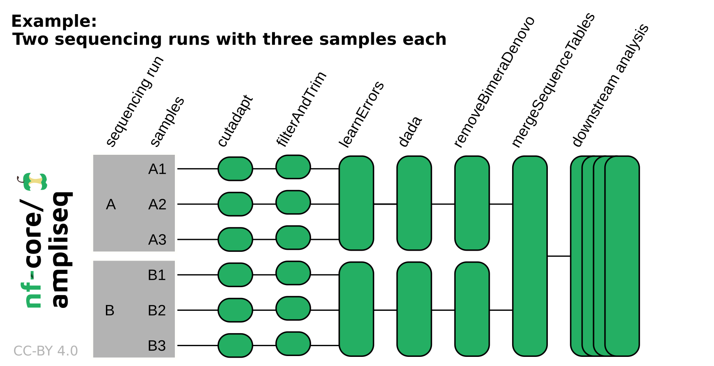

# nf-core/ampliseq: Usage

## :warning: Please read this documentation on the nf-core website: [https://nf-co.re/ampliseq/usage](https://nf-co.re/ampliseq/usage)

> _Documentation of pipeline parameters is generated automatically from the pipeline schema and can no longer be found in markdown files._

## Table of Contents

- [Running the pipeline](#running-the-pipeline)
  - [Quick start](#quick-start)
  - [Setting parameters in a file](#setting-parameters-in-a-file)
  - [Input specifications](#input-specifications)
    - [Samplesheet input](#samplesheet-input)
    - [ASV/OTU fasta input](#asvotu-fasta-input)
    - [Direct FASTQ input](#direct-fastq-input)
  - [Taxonomic classification](#taxonomic-classification)
  - [Multiple region analysis with Sidle](#multiple-region-analysis-with-sidle)
  - [Metadata](#metadata)
  - [Updating the pipeline](#updating-the-pipeline)
  - [Reproducibility](#reproducibility)
- [Core Nextflow arguments](#core-nextflow-arguments)
  - [-profile](#profile)
  - [-resume](#resume)
  - [-c](#c)
- [Custom configuration](#custom-configuration)
  - [Resource requests](#resource-requests)
  - [Updating containers](#updating-containers)
  - [nf-core/configs](#nf-coreconfigs)
- [Running in the background](#running-in-the-background)
- [Nextflow memory requirements](#nextflow-memory-requirements)

## Running the pipeline

### Quick start

The typical command for running the pipeline is as follows:

```bash
nextflow run nf-core/ampliseq \
    -r 2.7.1 \
    -profile singularity \
    --input "samplesheet.tsv" \
    --FW_primer GTGYCAGCMGCCGCGGTAA \
    --RV_primer GGACTACNVGGGTWTCTAAT \
    --metadata "data/Metadata.tsv" \
    --outdir "./results"
```

In this example, `--input` is the [Samplesheet input](#samplesheet-input), other options are [Direct FASTQ input](#direct-fastq-input) and [ASV/OTU fasta input](#asvotu-fasta-input). For more details on metadata, see [Metadata](#metadata). For [Reproducibility](#reproducibility), specify the version to run using `-r` (= release, e.g. 2.7.1, please use the most recent release). See the [nf-core/ampliseq website documentation](https://nf-co.re/ampliseq/parameters) for more information about pipeline specific parameters.

It is possible to not provide primer sequences (`--FW_primer` & `--RV_primer`) and skip primer trimming using `--skip_cutadapt`, but this is only for data that indeed does not contain any PCR primers in their sequences. Also, metadata (`--metadata`) isnt required, but aids downstream analysis.

This will launch the pipeline with the `singularity` configuration profile. See below [`-profile`](#profile) for more information about profiles.

Note that the pipeline will create the following files in your working directory:

```bash
work                # Directory containing the nextflow working files
<OUTDIR>            # Finished results in specified location (defined with --outdir)
.nextflow_log       # Log file from Nextflow
# Other nextflow hidden files, eg. history of pipeline runs and old logs.
```

:::note
If the data originates from multiple sequencing runs, the error profile of each of those sequencing runs needs to be considered separately. Using the `run` column in the samplesheet input or adding `--multiple_sequencing_runs` for direct FASTQ input will separate certain processes by the sequencing run. Please see the following example:
:::

<p align="center">
    
</p>

### Setting parameters in a file

If you wish to repeatedly use the same parameters for multiple runs, rather than specifying each flag in the command, you can specify these in a params file.

Pipeline settings can be provided in a `yaml` or `json` file via `-params-file <file>`.

:::warning
Do not use `-c <file>` to specify parameters as this will result in errors. Custom config files specified with `-c` must only be used for [tuning process resource specifications](https://nf-co.re/docs/usage/configuration#tuning-workflow-resources), other infrastructural tweaks (such as output directories), or module arguments (args).
:::

The above pipeline run specified with a params file in yaml format:

```bash
nextflow run nf-core/ampliseq -profile docker -params-file params.yaml
```

with `params.yaml` containing:

```yaml
input: "samplesheet.tsv"
FW_primer: "GTGYCAGCMGCCGCGGTAA"
RV_primer: "GGACTACNVGGGTWTCTAAT"
metadata: "data/Metadata.tsv"
outdir: "./results"
<...>
```

You can also generate such `YAML`/`JSON` files via [nf-core/launch](https://nf-co.re/launch).

### Input specifications

The input data can be passed to nf-core/ampliseq in three possible ways using the parameters `--input`, `--input_fasta`, or `--input_folder`.
The three parameters and input types are mutually exclusive.

- [Samplesheet input](#samplesheet-input) using `--input`: Samplesheet tab-separated, comma-separated, or in YAML format
- [ASV/OTU fasta input](#asvotu-fasta-input) using `--input_fasta`: Fasta file with sequences to be taxonomically classified
- [Direct FASTQ input](#direct-fastq-input) using `--input_folder`: Folder containing zipped FastQ files.

Optionally, a metadata sheet can be specified for downstream analysis.

#### Samplesheet input

The sample sheet file can be tab-separated (.tsv), comma-separated (.csv), or in YAML format (.yml/.yaml) and can have two to four columns/entries with the following headers:

| Column       | Necessity | Description                                                                   |
| ------------ | --------- | ----------------------------------------------------------------------------- |
| sampleID     | required  | Unique sample identifiers                                                     |
| forwardReads | required  | Paths to (forward) reads zipped FastQ files                                   |
| reverseReads | optional  | Paths to reverse reads zipped FastQ files, required if the data is paired-end |
| run          | optional  | If the data was produced by multiple sequencing runs, any string              |

```bash
--input 'path/to/samplesheet.tsv'
```

For example, the tab-separated samplesheet may contain:

| sampleID | forwardReads              | reverseReads              | run |
| -------- | ------------------------- | ------------------------- | --- |
| sample1  | ./data/S1_R1_001.fastq.gz | ./data/S1_R2_001.fastq.gz | A   |
| sample2  | ./data/S2_fw.fastq.gz     | ./data/S2_rv.fastq.gz     | A   |
| sample3  | ./S4x.fastq.gz            | ./S4y.fastq.gz            | B   |
| sample4  | ./a.fastq.gz              | ./b.fastq.gz              | B   |

Please note the following requirements:

- 2 to 4 columns/entries
- File extensions `.tsv`,`.csv`,`.yml`,`.yaml` specify the file type, otherwise file type will be derived from content, if possible
- Must contain the header `sampleID` and `forwardReads`
- May contain the header `reverseReads` and `run`
- Sample IDs must be unique
- Sample IDs must start with a letter
- Sample IDs can only contain letters, numbers or underscores
- FastQ files must be compressed (`.fastq.gz`, `.fq.gz`)
- Within one samplesheet, only one type of raw data should be specified (same amplicon & sequencing method)

An [example samplesheet](../assets/samplesheet.tsv) has been provided with the pipeline.

To avoid producing a sample sheet, [Direct FASTQ input](#direct-fastq-input) may be used instead.

#### ASV/OTU fasta input

To taxonomically classify pre-computed sequence files, a fasta format file with sequences may be provided.
Most of the steps of the pipeline will be skipped, but ITSx & Barrnap & length filtering can be applied before taxonomic classification.
The sequence header line may contain a description, that will be kept as part of the sequence name. However, tabs will be changed into spaces.

```bash
--input_fasta 'path/to/amplicon_sequences.fasta'
```

#### Direct FASTQ input

An easy way to input sequencing data to the pipeline is to specify directly the path to the folder that contains your input FASTQ files. For example:

```bash
--input_folder 'path/to/data/'
```

File names must follow a specific pattern, default is `/*_R{1,2}_001.fastq.gz`, but this can be adjusted with `--extension`.

For example, the following files in folder `data` would be processed as `sample1` and `sample2`:

```console
data
    |-sample1_1_L001_R1_001.fastq.gz
    |-sample1_1_L001_R2_001.fastq.gz
    |-sample2_1_L001_R1_001.fastq.gz
    |-sample2_1_L001_R2_001.fastq.gz
```

All sequencing data should originate from one sequencing run, because processing relies on run-specific error models that are unreliable when data from several sequencing runs are mixed. Sequencing data originating from multiple sequencing runs requires additionally the parameter `--multiple_sequencing_runs` and a specific folder structure, for example:

```console
data
    |-runA
    |   |-sample1_1_L001_R1_001.fastq.gz
    |   |-sample1_1_L001_R2_001.fastq.gz
    |   |-sample2_1_L001_R1_001.fastq.gz
    |   |-sample2_1_L001_R2_001.fastq.gz
    |
    |-runB
        |-sample3_1_L001_R1_001.fastq.gz
        |-sample3_1_L001_R2_001.fastq.gz
        |-sample4_1_L001_R1_001.fastq.gz
        |-sample4_1_L001_R2_001.fastq.gz
```

Where `sample1` and `sample2` were sequenced in one sequencing run and `sample3` and `sample4` in another sequencing run.

Please note the following additional requirements:

- Files names must be unique
- Valid file extensions: `.fastq.gz`, `.fq.gz` (files must be compressed)
- The path must be enclosed in quotes
- `--extension` must have at least one `*` wildcard character
- When using the pipeline with paired end data, the `--extension` must use `{1,2}` (or similar) notation to specify read pairs
- To run single-end data you must additionally specify `--single_end` and `--extension` may not include curly brackets `{}`
- Sample identifiers are extracted from file names, i.e. the string before the first underscore `_`, these must be unique (also across sequencing runs)
- If your data is scattered, produce a sample sheet

### Taxonomic classification

Taxonomic classification of ASVs can be performed with tools DADA2, SINTAX, Kraken2 or QIIME2. Multiple taxonomic reference databases are pre-configured for those tools, but user supplied databases are also supported for some tools. Alternatively (or in addition), phylogenetic placement can be used to extract taxonomic classifications.

In case multiple tools for taxonomic classification are executed in one pipeline run, only the taxonomic classification result of one tool is forwarded to downstream analysis with QIIME2. The priority is `phylogenetic placement` > `DADA2` > `SINTAX` > `Kraken2` > `QIIME2`.

Default setting for taxonomic classification is DADA2 with the SILVA reference taxonomy database.

Pre-configured reference taxonomy databases are:

| Database key | DADA2 | SINTAX | Kraken2 | QIIME2 | Target genes                                  |
| ------------ | ----- | ------ | ------- | ------ | --------------------------------------------- |
| silva        | +     | -      | +       | +      | 16S rRNA                                      |
| gtdb         | +¹    | -      | -       | -      | 16S rRNA                                      |
| sbdi-gtdb    | +     | -      | -       | -      | 16S rRNA                                      |
| rdp          | +     | -      | +       | -      | 16S rRNA                                      |
| greengenes   | -     | -      | +       | (+)²   | 16S rRNA                                      |
| greengenes2  | -     | -      | -       | +      | 16S rRNA                                      |
| pr2          | +     | -      | -       | -      | 18S rRNA                                      |
| unite-fungi  | +     | +      | -       | +      | eukaryotic nuclear ribosomal ITS region       |
| unite-alleuk | +     | +      | -       | +      | eukaryotic nuclear ribosomal ITS region       |
| coidb        | +     | +      | -       | -      | eukaryotic Cytochrome Oxidase I (COI)         |
| midori2-co1  | +     | -      | -       | -      | eukaryotic Cytochrome Oxidase I (COI)         |
| phytoref     | +     | -      | -       | -      | eukaryotic plastid 16S rRNA                   |
| zehr-nifh    | +     | -      | -       | -      | Nitrogenase iron protein NifH                 |
| standard     | -     | -      | +       | -      | any in genomes of archaea, bacteria, viruses³ |

¹[`--dada_taxonomy_rc`](https://nf-co.re/ampliseq/parameters#dada_taxonomy_rc) is recommended; ²: de-replicated at 85%, only for testing purposes; ³: quality of results might vary

Special features of taxonomic classification tools:

- DADA2's reference taxonomy databases **can** have regions matching the amplicon extracted with primer sequences.
- Kraken2 is very fast and can use large databases containing complete genomes.
- QIIME2's reference taxonomy databases will have regions matching the amplicon extracted with primer sequences.
- DADA2, Kraken2, and QIIME2 have specific parameters to accept custom databases (but theoretically possible with all classifiers)

Parameter guidance is given in [nf-core/ampliseq website parameter documentation](https://nf-co.re/ampliseq/parameters/#taxonomic-database). Citations are listed in [`CITATIONS.md`](CITATIONS.md).

### Multiple region analysis with Sidle

Instead of relying on one short amplicon, scaffolding multiple regions along a reference can improve resolution over a single region. This method applies [Sidle (SMURF Implementation Done to acceLerate Efficiency)](https://github.com/jwdebelius/q2-sidle) within [QIIME2](https://qiime2.org/) with [Silva](https://www.arb-silva.de/) (see [licence](https://www.arb-silva.de/silva-license-information/)) or [Greengenes](http://greengenes.microbio.me/greengenes_release/) database.

For example, multiple variable regions of the 16S rRNA gene were sequenced with various primers and need to be unified. This leads to one unified abundance and taxonomy profile over all variable regions. However, ASV sequences are only available separately, there is no reconstruction of complete de-novo sequences feasible.

Information about sequencing data via [`--input`](#samplesheet-input), region primers length information via [`--multiregion`](https://nf-co.re/ampliseq/parameters#multiregion), and a taxonomic database via [`--sidle_ref_taxonomy`](https://nf-co.re/ampliseq/parameters#sidle_ref_taxonomy) or [`--sidle_ref_tax_custom`](https://nf-co.re/ampliseq/parameters#sidle_ref_tax_custom) is required.

```bash
--input "samplesheet_multiregion.tsv"  --multiregion "regions_multiregion.tsv" --sidle_ref_taxonomy "silva=128"
```

The region information file can be tab-separated (.tsv), comma-separated (.csv), or in YAML format (.yml/.yaml) and can have two to four columns/entries with the following headers:

| Column        | Description                                                               |
| ------------- | ------------------------------------------------------------------------- |
| region        | Unique region identifier                                                  |
| region_length | Minimum region length, sequences are trimmed and shorter ones are omitted |
| FW_primer     | Forward primer sequence                                                   |
| RV_primer     | Reverse primer sequence                                                   |

For example, the tab-separated `regions_multiregion.tsv` may contain:

| region  | FW_primer             | RV_primer            | region_length |
| ------- | --------------------- | -------------------- | ------------- |
| region1 | TGGCGAACGGGTGAGTAA    | CCGTGTCTCAGTCCCARTG  | 145           |
| region2 | ACTCCTACGGGAGGCAGC    | GTATTACCGCGGCTGCTG   | 135           |
| region3 | GTGTAGCGGTGRAATGCG    | CCCGTCAATTCMTTTGAGTT | 200           |
| region4 | GGAGCATGTGGWTTAATTCGA | CGTTGCGGGACTTAACCC   | 115           |
| region5 | GGAGGAAGGTGGGGATGAC   | AAGGCCCGGGAACGTATT   | 150           |

### Metadata

Metadata is optional, but for performing downstream analysis such as barplots, diversity indices or differential abundance testing, a metadata file is essential.

```bash
--metadata "path/to/metadata.tsv"
```

For example:

| ID      | condition |
| ------- | --------- |
| sample1 | control   |
| sample2 | treatment |
| sample3 | control   |
| sample4 | treatment |

Please note the following requirements:

- The path must be enclosed in quotes
- The metadata file has to follow the QIIME2 specifications (https://docs.qiime2.org/2021.2/tutorials/metadata/)

The metadata file must be tab-separated with a header line. The first column in the tab-separated metadata file is the sample identifier column (required header: ID) and defines the sample or feature IDs associated with the dataset. In addition to the sample identifier column, the metadata file is required to have at least one column with multiple different non-numeric values but not all unique.

Sample identifiers should be 36 characters long or less, and also contain only ASCII alphanumeric characters (i.e. in the range of [a-z], [A-Z], or [0-9]), or the dash (-) character. For downstream analysis, by default all numeric columns, blanks or NA are removed, and only columns with multiple different values but not all unique are selected.

The columns which are to be assessed can be specified by `--metadata_category`. If `--metadata_category` isn't specified than all columns that fit the specification are automatically chosen.

### Updating the pipeline

When you run the above command, Nextflow automatically pulls the pipeline code from GitHub and stores it as a cached version. When running the pipeline after this, it will always use the cached version if available - even if the pipeline has been updated since. To make sure that you're running the latest version of the pipeline, make sure that you regularly update the cached version of the pipeline:

```bash
nextflow pull nf-core/ampliseq
```

### Reproducibility

It is a good idea to specify a pipeline version when running the pipeline on your data. This ensures that a specific version of the pipeline code and software are used when you run your pipeline. If you keep using the same tag, you'll be running the same version of the pipeline, even if there have been changes to the code since.

First, go to the [nf-core/ampliseq releases page](https://github.com/nf-core/ampliseq/releases) and find the latest pipeline version - numeric only (eg. `2.4.1`). Then specify this when running the pipeline with `-r` (one hyphen) - eg. `-r 2.4.1`. Of course, you can switch to another version by changing the number after the `-r` flag.

This version number will be logged in reports when you run the pipeline, so that you'll know what you used when you look back in the future. For example, at the bottom of the MultiQC reports.

To further assist in reproducbility, you can use share and re-use [parameter files](#running-the-pipeline) to repeat pipeline runs with the same settings without having to write out a command with every single parameter.

:::tip
If you wish to share such profile (such as upload as supplementary material for academic publications), make sure to NOT include cluster specific paths to files, nor institutional specific profiles.
:::

## Core Nextflow arguments

:::note
These options are part of Nextflow and use a _single_ hyphen (pipeline parameters use a double-hyphen).
:::

### `-profile`

Use this parameter to choose a configuration profile. Profiles can give configuration presets for different compute environments.

Several generic profiles are bundled with the pipeline which instruct the pipeline to use software packaged using different methods (Docker, Singularity, Podman, Shifter, Charliecloud, Apptainer, Conda) - see below.

:::info
We highly recommend the use of Docker or Singularity containers for full pipeline reproducibility, however when this is not possible, Conda is also supported.
:::

The pipeline also dynamically loads configurations from [https://github.com/nf-core/configs](https://github.com/nf-core/configs) when it runs, making multiple config profiles for various institutional clusters available at run time. For more information and to see if your system is available in these configs please see the [nf-core/configs documentation](https://github.com/nf-core/configs#documentation).

Note that multiple profiles can be loaded, for example: `-profile test,docker` - the order of arguments is important!
They are loaded in sequence, so later profiles can overwrite earlier profiles.

If `-profile` is not specified, the pipeline will run locally and expect all software to be installed and available on the `PATH`. This is _not_ recommended, since it can lead to different results on different machines dependent on the computer enviroment.

- `test`
  - A profile with a complete configuration for automated testing
  - Includes links to test data so needs no other parameters
- `docker`
  - A generic configuration profile to be used with [Docker](https://docker.com/)
- `singularity`
  - A generic configuration profile to be used with [Singularity](https://sylabs.io/docs/)
- `podman`
  - A generic configuration profile to be used with [Podman](https://podman.io/)
- `shifter`
  - A generic configuration profile to be used with [Shifter](https://nersc.gitlab.io/development/shifter/how-to-use/)
- `charliecloud`
  - A generic configuration profile to be used with [Charliecloud](https://hpc.github.io/charliecloud/)
- `apptainer`
  - A generic configuration profile to be used with [Apptainer](https://apptainer.org/)
- `conda`
  - A generic configuration profile to be used with [Conda](https://conda.io/docs/). Please only use Conda as a last resort i.e. when it's not possible to run the pipeline with Docker, Singularity, Podman, Shifter, Charliecloud, or Apptainer.

### `-resume`

Specify this when restarting a pipeline. Nextflow will use cached results from any pipeline steps where the inputs are the same, continuing from where it got to previously. For input to be considered the same, not only the names must be identical but the files' contents as well. For more info about this parameter, see [this blog post](https://www.nextflow.io/blog/2019/demystifying-nextflow-resume.html).

You can also supply a run name to resume a specific run: `-resume [run-name]`. Use the `nextflow log` command to show previous run names.

### `-c`

Specify the path to a specific config file (this is a core Nextflow command). See the [nf-core website documentation](https://nf-co.re/usage/configuration) for more information.

## Custom configuration

### Resource requests

Whilst the default requirements set within the pipeline will hopefully work for most people and with most input data, you may find that you want to customise the compute resources that the pipeline requests. Each step in the pipeline has a default set of requirements for number of CPUs, memory and time. For most of the steps in the pipeline, if the job exits with any of the error codes specified [here](https://github.com/nf-core/rnaseq/blob/4c27ef5610c87db00c3c5a3eed10b1d161abf575/conf/base.config#L18) it will automatically be resubmitted with higher requests (2 x original, then 3 x original). If it still fails after the third attempt then the pipeline execution is stopped.

To change the resource requests, please see the [max resources](https://nf-co.re/docs/usage/configuration#max-resources) and [tuning workflow resources](https://nf-co.re/docs/usage/configuration#tuning-workflow-resources) section of the nf-core website.

### Custom Containers

In some cases you may wish to change which container or conda environment a step of the pipeline uses for a particular tool. By default nf-core pipelines use containers and software from the [biocontainers](https://biocontainers.pro/) or [bioconda](https://bioconda.github.io/) projects. However in some cases the pipeline specified version maybe out of date.

To use a different container from the default container or conda environment specified in a pipeline, please see the [updating tool versions](https://nf-co.re/docs/usage/configuration#updating-tool-versions) section of the nf-core website.

### Custom Tool Arguments

A pipeline might not always support every possible argument or option of a particular tool used in pipeline. Fortunately, nf-core pipelines provide some freedom to users to insert additional parameters that the pipeline does not include by default.

To learn how to provide additional arguments to a particular tool of the pipeline, please see the [customising tool arguments](https://nf-co.re/docs/usage/configuration#customising-tool-arguments) section of the nf-core website.

### nf-core/configs

In most cases, you will only need to create a custom config as a one-off but if you and others within your organisation are likely to be running nf-core pipelines regularly and need to use the same settings regularly it may be a good idea to request that your custom config file is uploaded to the `nf-core/configs` git repository. Before you do this please can you test that the config file works with your pipeline of choice using the `-c` parameter. You can then create a pull request to the `nf-core/configs` repository with the addition of your config file, associated documentation file (see examples in [`nf-core/configs/docs`](https://github.com/nf-core/configs/tree/master/docs)), and amending [`nfcore_custom.config`](https://github.com/nf-core/configs/blob/master/nfcore_custom.config) to include your custom profile.

See the main [Nextflow documentation](https://www.nextflow.io/docs/latest/config.html) for more information about creating your own configuration files.

If you have any questions or issues please send us a message on [Slack](https://nf-co.re/join/slack) on the [`#configs` channel](https://nfcore.slack.com/channels/configs).

## Azure Resource Requests

To be used with the `azurebatch` profile by specifying the `-profile azurebatch`.
We recommend providing a compute `params.vm_type` of `Standard_D16_v3` VMs by default but these options can be changed if required.

Note that the choice of VM size depends on your quota and the overall workload during the analysis.
For a thorough list, please refer the [Azure Sizes for virtual machines in Azure](https://docs.microsoft.com/en-us/azure/virtual-machines/sizes).

## Running in the background

Nextflow handles job submissions and supervises the running jobs. The Nextflow process must run until the pipeline is finished.

The Nextflow `-bg` flag launches Nextflow in the background, detached from your terminal so that the workflow does not stop if you log out of your session. The logs are saved to a file.

Alternatively, you can use `screen` / `tmux` or similar tool to create a detached session which you can log back into at a later time.
Some HPC setups also allow you to run nextflow within a cluster job submitted your job scheduler (from where it submits more jobs).

## Nextflow memory requirements

In some cases, the Nextflow Java virtual machines can start to request a large amount of memory.
We recommend adding the following line to your environment to limit this (typically in `~/.bashrc` or `~./bash_profile`):

```bash
NXF_OPTS='-Xms1g -Xmx4g'
```
